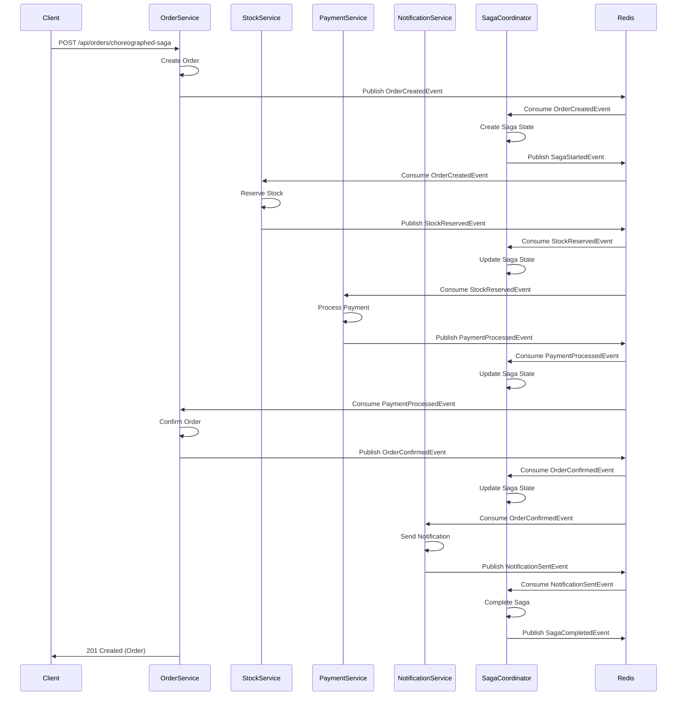
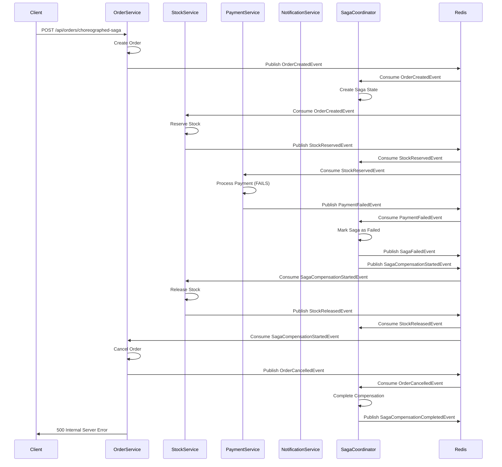
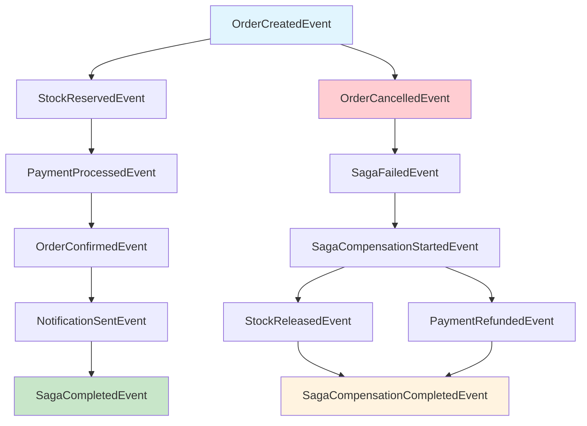

# Choreographed Saga Pattern - Sequence Diagrams

This document describes the choreographed saga pattern implementation for distributed transaction management in the Corner Shop system.

## Overview

The choreographed saga pattern uses events to coordinate distributed transactions across multiple microservices. Each service publishes events when it completes its part of the transaction, and other services listen for these events to trigger their own actions.

## Business Scenario

**Order Processing Saga**: When a customer places an order, the system must:
1. Create the order
2. Reserve stock
3. Process payment
4. Confirm the order
5. Send notifications

If any step fails, the system must compensate (rollback) the completed steps.

## Sequence Diagram - Successful Order Processing



## Sequence Diagram - Failed Order Processing (with Compensation)



## Event Flow Diagram



## Event Types and Data

### Initiation Events
- **OrderCreatedEvent**: Triggers the saga when an order is created
  - Contains: orderId, customerId, totalAmount, items

### Success Events
- **StockReservedEvent**: Published when stock is successfully reserved
  - Contains: orderId, items
- **PaymentProcessedEvent**: Published when payment is processed
  - Contains: orderId, customerId, amount, paymentMethod
- **OrderConfirmedEvent**: Published when order is confirmed
  - Contains: orderId, customerId
- **NotificationSentEvent**: Published when notification is sent
  - Contains: orderId, customerId, notificationType

### Compensation Events
- **OrderCancelledEvent**: Published when order is cancelled
  - Contains: orderId, customerId, reason
- **StockReleasedEvent**: Published when stock is released
  - Contains: orderId, items
- **PaymentRefundedEvent**: Published when payment is refunded
  - Contains: orderId, customerId, amount, reason

### Saga State Events
- **SagaStartedEvent**: Published when saga begins
- **SagaCompletedEvent**: Published when saga completes successfully
- **SagaFailedEvent**: Published when saga fails
- **SagaCompensationStartedEvent**: Published when compensation begins
- **SagaCompensationCompletedEvent**: Published when compensation completes

## Saga State Management

The ChoreographedSagaCoordinator service maintains the state of each saga:

```json
{
  "sagaId": "uuid",
  "businessProcess": "OrderProcessing",
  "initiatorId": "order-123",
  "status": "InProgress|Completed|Failed",
  "startedAt": "2024-01-01T10:00:00Z",
  "completedAt": "2024-01-01T10:05:00Z",
  "steps": [
    {
      "stepName": "OrderCreated",
      "status": "Completed",
      "completedAt": "2024-01-01T10:00:00Z"
    },
    {
      "stepName": "StockReserved",
      "status": "Completed",
      "completedAt": "2024-01-01T10:01:00Z"
    }
  ]
}
```

## Compensation Strategy

The compensation follows the reverse order of successful operations:

1. **OrderCreated** → **OrderCancelled**
2. **StockReserved** → **StockReleased**
3. **PaymentProcessed** → **PaymentRefunded**

## Monitoring and Observability

### Metrics Collected
- Total sagas started
- Total sagas completed
- Total sagas failed
- Compensation rate
- Average saga duration
- Success rate by business process

### API Endpoints
- `GET /api/choreographedsaga/states` - Get all saga states
- `GET /api/choreographedsaga/statistics` - Get saga statistics
- `GET /api/choreographedsaga/metrics` - Get saga metrics
- `GET /api/choreographedsaga/state/{sagaId}` - Get specific saga state

## Benefits of Choreographed Saga Pattern

1. **Decoupling**: Services communicate only through events
2. **Scalability**: Each service can scale independently
3. **Fault Tolerance**: Automatic compensation on failures
4. **Observability**: Complete audit trail of all operations
5. **Flexibility**: Easy to add new steps or modify existing ones

## Comparison with Orchestrated Saga

| Aspect | Choreographed | Orchestrated |
|--------|---------------|--------------|
| Coordination | Event-driven | Central orchestrator |
| Coupling | Loose | Tight to orchestrator |
| Scalability | High | Limited by orchestrator |
| Complexity | Distributed | Centralized |
| Failure Handling | Automatic | Manual orchestration |
| Monitoring | Event-based | Orchestrator-based | 