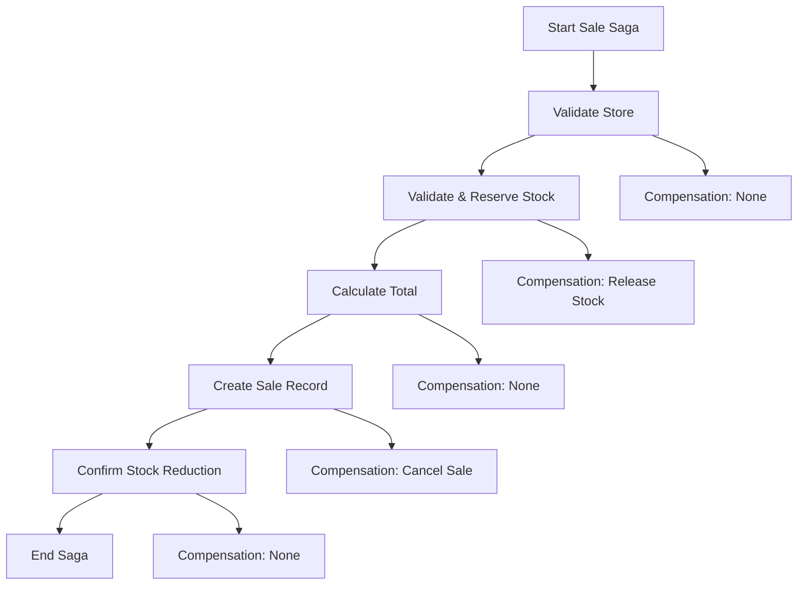
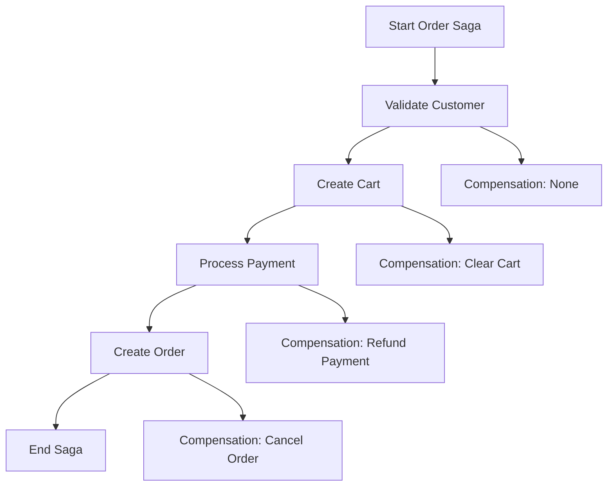
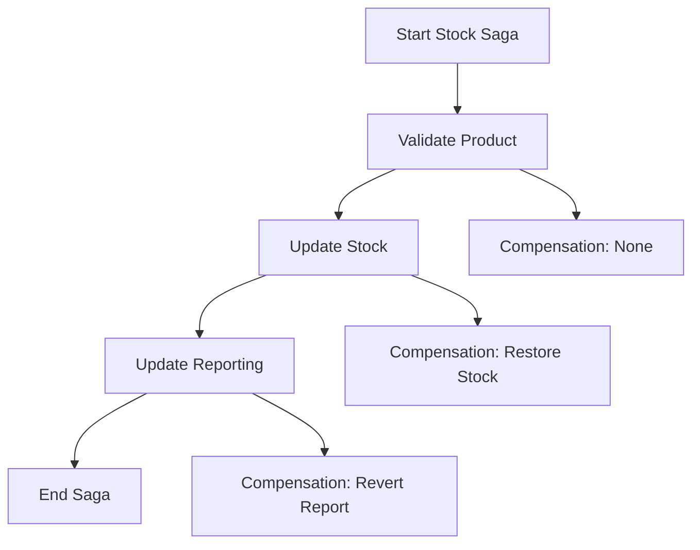

# Saga Orchestration in Corner Shop

## What is Saga Orchestration?

Saga Orchestration is a pattern for managing distributed transactions across multiple microservices. It's particularly useful in microservices architectures where you need to maintain data consistency across services that don't share a database.

### Enhanced Features

The Corner Shop implementation includes advanced features beyond basic saga orchestration:

1. **Event Publishing**: Each microservice publishes success/failure events after processing
2. **State Machine**: Explicit state machine with enum, logging, and persistence
3. **State Tracking**: Real-time state updates and transition history
4. **Event Store**: Complete audit trail of all saga events
5. **Controlled Failures**: Configurable failure simulation for testing and observation
6. **Enhanced Compensation**: Detailed compensation tracking and rollback mechanisms

### Key Concepts

1. **Saga**: A sequence of local transactions where each transaction updates data within a single service
2. **Orchestration**: A centralized coordinator that manages the entire transaction flow
3. **Compensation**: Actions to undo previous steps if something fails
4. **Event-Driven**: Services communicate through events/messages

### Why Saga Orchestration?

In traditional monolithic applications, transactions are handled by the database using ACID properties. However, in microservices architectures:

- Each service has its own database
- Network calls between services can fail
- Services can be temporarily unavailable
- Maintaining consistency across services is challenging

Saga Orchestration solves these problems by:
- Breaking complex transactions into smaller, manageable steps
- Providing compensation mechanisms for rollback
- Ensuring eventual consistency across services
- Handling partial failures gracefully

## Implementation in Corner Shop

### Architecture Overview

The Corner Shop system implements Saga Orchestration with the following components:

```
┌─────────────────┐    ┌─────────────────┐    ┌─────────────────┐
│   API Gateway   │    │  Saga Controller│    │ Saga Orchestrator│
│                 │    │                 │    │                 │
│  /api/v1/saga/  │───▶│  SagaApiController│───▶│  SagaOrchestrator │
└─────────────────┘    └─────────────────┘    └─────────────────┘
                                                       │
                                                       ▼
┌─────────────────┐    ┌─────────────────┐    ┌─────────────────┐
│  Product Service│    │   Sale Service  │    │  Store Service  │
│                 │    │                 │    │                 │
│ - Validate Stock│    │ - Create Sale   │    │ - Validate Store│
│ - Update Stock  │    │ - Calculate Total│   │ - Get Store Info│
└─────────────────┘    └─────────────────┘    └─────────────────┘
```

### Core Components

#### 1. ISagaOrchestrator Interface

```csharp
public interface ISagaOrchestrator
{
    Task<SagaResult> ExecuteSaleSagaAsync(CreateSaleRequest saleRequest);
    Task<SagaResult> ExecuteOrderSagaAsync(CreateOrderRequest orderRequest);
    Task<SagaResult> ExecuteStockUpdateSagaAsync(StockUpdateRequest stockRequest);
    Task<SagaResult> CompensateSagaAsync(string sagaId);
}
```

#### 2. Event Publishing System

```csharp
public interface ISagaEventPublisher
{
    Task PublishSagaEventAsync(string sagaId, string serviceName, string action, SagaEventType eventType, string? message = null, object? data = null);
}
```

#### 3. State Machine Management

```csharp
public interface ISagaStateManager
{
    Task<SagaStateMachine> CreateSagaAsync(string sagaId, string sagaType);
    Task<SagaStateMachine?> GetSagaAsync(string sagaId);
    Task UpdateSagaStateAsync(string sagaId, SagaState newState, string serviceName, string action, SagaEventType eventType, string? message = null, object? data = null);
    Task<List<SagaStateMachine>> GetAllSagasAsync();
    Task<List<SagaStateMachine>> GetSagasByStateAsync(SagaState state);
    Task<List<SagaStateTransition>> GetSagaTransitionsAsync(string sagaId);
    Task PersistSagaAsync(SagaStateMachine saga);
}
```

#### 4. SagaResult and SagaStep Models

```csharp
public class SagaResult
{
    public bool IsSuccess { get; set; }
    public string SagaId { get; set; }
    public string? ErrorMessage { get; set; }
    public List<SagaStep> Steps { get; set; }
    public DateTime CreatedAt { get; set; }
    public DateTime? CompletedAt { get; set; }
}

public class SagaStep
{
    public string StepId { get; set; }
    public string ServiceName { get; set; }
    public string Action { get; set; }
    public bool IsCompleted { get; set; }
    public bool IsCompensated { get; set; }
    public string? ErrorMessage { get; set; }
    public DateTime ExecutedAt { get; set; }
    public object? Data { get; set; }
    public Func<Task>? CompensationAction { get; set; }
}
```

#### 5. State Machine Models

```csharp
public enum SagaState
{
    Started = 0,
    StoreValidated = 1,
    StockReserved = 2,
    TotalCalculated = 3,
    SaleCreated = 4,
    StockConfirmed = 5,
    Completed = 6,
    Failed = 7,
    Compensating = 8,
    Compensated = 9
}

public enum SagaEventType
{
    Success = 0,
    Failure = 1
}

public class SagaStateMachine
{
    public string SagaId { get; set; }
    public SagaState CurrentState { get; set; }
    public string SagaType { get; set; }
    public DateTime CreatedAt { get; set; }
    public DateTime? UpdatedAt { get; set; }
    public DateTime? CompletedAt { get; set; }
    public string? ErrorMessage { get; set; }
    public List<SagaStateTransition> Transitions { get; set; }
    public bool IsCompleted => CurrentState == SagaState.Completed || CurrentState == SagaState.Compensated;
    public bool IsFailed => CurrentState == SagaState.Failed;
    public bool IsCompensating => CurrentState == SagaState.Compensating;
}

public class SagaStateTransition
{
    public string Id { get; set; }
    public string SagaId { get; set; }
    public SagaState FromState { get; set; }
    public SagaState ToState { get; set; }
    public string ServiceName { get; set; }
    public string Action { get; set; }
    public SagaEventType EventType { get; set; }
    public string? Message { get; set; }
    public DateTime Timestamp { get; set; }
    public object? Data { get; set; }
}
```

### Saga Types Implemented

#### 1. Sale Saga

The Sale Saga handles the complete sale creation process:



**Steps:**
1. **Validate Store**: Ensure the store exists
2. **Validate & Reserve Stock**: Check product availability and reserve stock
3. **Calculate Total**: Compute sale total
4. **Create Sale Record**: Persist sale in database
5. **Confirm Stock Reduction**: Finalize stock updates and check reorder levels

**Compensation Actions:**
- If stock reservation fails: Release any reserved stock
- If sale creation fails: Cancel the sale and restore stock

#### 2. Order Saga

The Order Saga handles complete order processing:



**Steps:**
1. **Validate Customer**: Ensure customer exists and is valid
2. **Create Cart**: Initialize shopping cart
3. **Process Payment**: Handle payment processing
4. **Create Order**: Generate order record

#### 3. Stock Update Saga

The Stock Update Saga handles inventory modifications:



**Steps:**
1. **Validate Product**: Ensure product exists
2. **Update Stock**: Modify inventory levels
3. **Update Reporting**: Update reporting data

## Controlled Failures and Testing

### Overview

The system includes a comprehensive controlled failure simulation system that allows testing and observing how failures affect saga orchestration and state machine transitions.

### Failure Types

1. **Insufficient Stock**: Simulates stock unavailability for products
2. **Payment Failure**: Simulates payment processing failures
3. **Network Timeout**: Simulates network connectivity issues
4. **Database Failure**: Simulates database connection problems
5. **Service Unavailable**: Simulates service unavailability

### Failure Configuration

Failures can be configured with different probabilities and conditions:

```json
{
  "EnableFailures": true,
  "InsufficientStockProbability": 0.1,
  "PaymentFailureProbability": 0.05,
  "NetworkTimeoutProbability": 0.03,
  "DatabaseFailureProbability": 0.02,
  "ServiceUnavailableProbability": 0.01,
  "FailureDelayMs": 1000,
  "CriticalProducts": ["Premium Coffee", "Organic Milk"],
  "CriticalStores": ["store_001", "store_002"]
}
```

### Enhanced Compensation

The system includes detailed compensation tracking:

```csharp
public class CompensationResult
{
    public string StepId { get; set; }
    public string ServiceName { get; set; }
    public string Action { get; set; }
    public bool IsSuccessful { get; set; }
    public string? ErrorMessage { get; set; }
    public DateTime StartedAt { get; set; }
    public DateTime? CompletedAt { get; set; }
    public TimeSpan? Duration => CompletedAt?.Subtract(StartedAt);
}
```

### Observing Failure Effects

When failures occur, you can observe:

1. **State Machine Transitions**: How the saga state changes
2. **Compensation Actions**: Which rollback actions are executed
3. **Event Publishing**: Success/failure events from each service
4. **Compensation Results**: Detailed results of compensation attempts
5. **Statistics**: Failure rates and compensation success rates

### API Endpoints

#### Controlled Failure Management Endpoints

##### GET /api/ControlledFailure/config
Get current failure configuration.

##### PUT /api/ControlledFailure/config
Update failure configuration.

##### POST /api/ControlledFailure/toggle
Enable or disable controlled failures.

##### POST /api/ControlledFailure/probability
Set failure probability for a specific failure type.

##### GET /api/ControlledFailure/affected-sagas
Get sagas affected by failures.

##### GET /api/ControlledFailure/compensation-stats
Get compensation statistics.

##### POST /api/ControlledFailure/simulate
Simulate a specific failure type.

#### Saga Orchestration Endpoints

##### Execute Sale Saga
```http
POST /api/v1/saga/sale
Content-Type: application/json

{
  "storeId": "store123",
  "items": [
    {
      "productName": "Milk",
      "quantity": 2,
      "unitPrice": 3.99
    }
  ]
}
```

#### Get Saga State
```http
GET /api/v1/saga-state/{sagaId}
```

#### Get Saga Transitions
```http
GET /api/v1/saga-state/{sagaId}/transitions
```

#### Get All Sagas
```http
GET /api/v1/saga-state
```

#### Get Sagas by State
```http
GET /api/v1/saga-state/by-state/{state}
```

#### Get All Events
```http
GET /api/v1/saga-state/events
```

#### Execute Order Saga
```http
POST /api/v1/saga/order
Content-Type: application/json

{
  "customerId": "customer123",
  "storeId": "store123",
  "items": [
    {
      "productName": "Bread",
      "quantity": 1,
      "unitPrice": 2.49
    }
  ],
  "paymentMethod": "credit_card"
}
```

#### Execute Stock Update Saga
```http
POST /api/v1/saga/stock
Content-Type: application/json

{
  "productName": "Milk",
  "storeId": "store123",
  "quantity": 10,
  "operation": "add"
}
```

#### Compensate Saga
```http
POST /api/v1/saga/compensate/{sagaId}
```

### Error Handling and Compensation

#### Automatic Compensation
When a saga step fails, the orchestrator automatically:
1. Logs the error
2. Executes compensation actions for completed steps (in reverse order)
3. Returns detailed error information

#### Manual Compensation
You can manually trigger compensation for a specific saga:
```http
POST /api/v1/saga/compensate/abc123-def456-ghi789
```

#### Compensation Examples

**Sale Saga Compensation:**
```csharp
// If sale creation fails after stock reservation
async () =>
{
    // Release reserved stock
    foreach (var item in saleRequest.Items)
    {
        await _productService.UpdateStock(item.ProductName, saleRequest.StoreId, item.Quantity);
    }
}
```

**Order Saga Compensation:**
```csharp
// If order creation fails after payment
async () =>
{
    // Refund payment
    await _paymentService.RefundPayment(paymentId);
    // Clear cart
    await _cartService.ClearCart(cartId);
}
```

### Benefits in Corner Shop

#### 1. Data Consistency
- Ensures inventory and sales data remain consistent
- Prevents overselling products
- Maintains accurate financial records

#### 2. Fault Tolerance
- Handles network failures gracefully
- Provides automatic rollback mechanisms
- Maintains system stability during partial failures

#### 3. Scalability
- Supports the microservices architecture
- Enables independent service scaling
- Facilitates service deployment and updates

#### 4. Observability
- Detailed logging of all saga steps
- Clear visibility into transaction flows
- Easy debugging and monitoring

#### 5. Event-Driven Architecture
- Microservices publish events after processing
- Loose coupling between services
- Real-time event tracking and correlation

#### 6. State Machine Management
- Explicit state tracking with enum
- Complete transition history
- State-based filtering and querying
- Persistent state management

### Monitoring and Observability

#### Prometheus Metrics
- **Saga Execution Metrics**: Total, success, failure counts, duration histograms
- **Step Metrics**: Step execution counts, success rates, duration tracking
- **State Transition Metrics**: State evolution tracking
- **Compensation Metrics**: Compensation success rates and duration
- **Controlled Failure Metrics**: Failure simulation tracking
- **Business Event Metrics**: Business event frequency monitoring
- **Real-time Gauges**: Active sagas, sagas by state

#### Grafana Visualization
- **Saga Orchestration Dashboard**: Comprehensive monitoring dashboard
- **State Evolution Visualization**: Real-time state transition tracking
- **Performance Analysis**: Duration percentiles and trends
- **Success Rate Monitoring**: Real-time success/failure rates
- **Compensation Tracking**: Compensation effectiveness monitoring
- **Controlled Failure Analysis**: Failure pattern visualization

#### Structured Logging
- **Business Event Logging**: JSON format business events with correlation IDs
- **Decision Logging**: Business decisions with context and reasoning
- **Saga Lifecycle Logging**: Complete saga lifecycle tracking
- **State Transition Logging**: State machine transitions with context
- **Compensation Logging**: Compensation action tracking with results
- **Controlled Failure Logging**: Simulated failure events with details

#### API Endpoints for Monitoring
- **Metrics Summary**: `/api/SagaMetrics/summary`
- **Prometheus Format**: `/api/SagaMetrics/prometheus`
- **Performance Statistics**: `/api/SagaMetrics/performance`
- **State Distribution**: `/api/SagaMetrics/state-distribution`
- **Transition Analysis**: `/api/SagaMetrics/transition-analysis`
- **Duration Statistics**: `/api/SagaMetrics/duration-stats`
- **Recent Activity**: `/api/SagaMetrics/recent-activity`
- **Grafana Integration**: `/api/SagaMetrics/grafana`

#### Health Checks
- Saga orchestrator health
- Service availability
- Database connectivity
- Compensation queue status
- Metrics collection health

### Best Practices

#### 1. Idempotency
- All saga steps should be idempotent
- Compensation actions should be safe to execute multiple times
- Use unique identifiers for all operations

#### 2. Timeout Handling
- Set appropriate timeouts for each step
- Implement retry mechanisms for transient failures
- Use circuit breakers for external service calls

#### 3. Monitoring
- Monitor saga execution times
- Alert on high failure rates
- Track compensation frequency
- Monitor service dependencies

#### 4. Testing
- Test happy path scenarios
- Test failure scenarios
- Test compensation mechanisms
- Load test saga execution

### Future Enhancements

#### 1. Event-Driven Architecture
- Implement event sourcing for saga state
- Use message queues for service communication
- Add event replay capabilities

#### 2. Advanced Compensation
- Implement compensation strategies
- Add compensation scheduling
- Support partial compensation

#### 3. Saga Persistence
- Persist saga state to database
- Support saga recovery after system restart
- Add saga history and audit trails

#### 4. Distributed Tracing
- Integrate with OpenTelemetry
- Add correlation IDs across services
- Implement distributed logging

### Conclusion

Saga Orchestration provides a robust solution for managing distributed transactions in the Corner Shop microservices architecture. It ensures data consistency, provides fault tolerance, and enables scalable, maintainable code.

The implementation follows best practices for distributed systems and provides a solid foundation for future enhancements and scaling. 