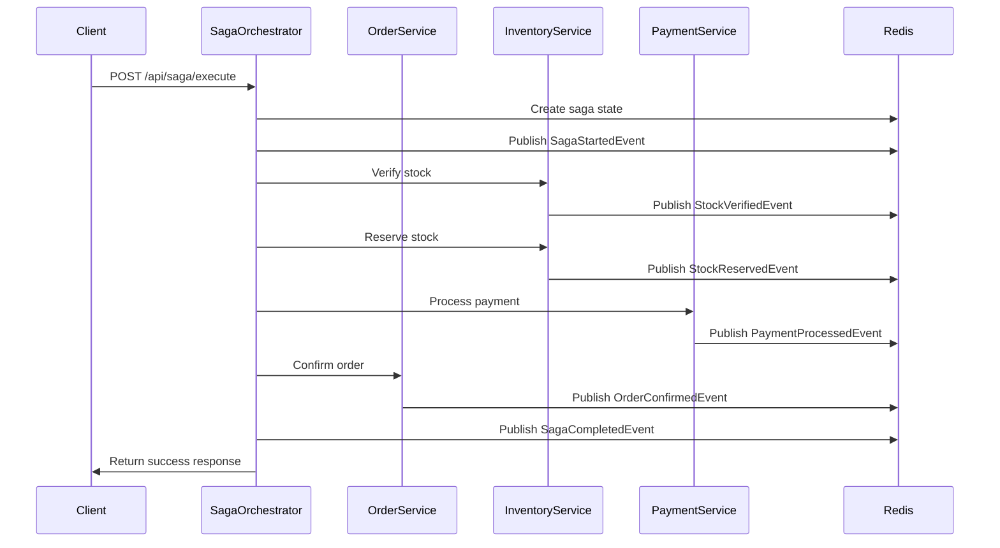
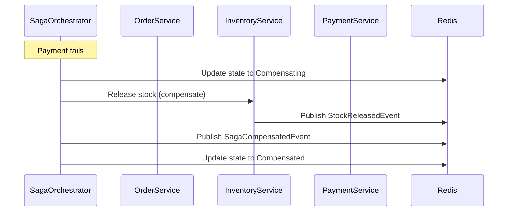

# Saga Orchestration in Microservices Architecture

## Overview

This document describes the implementation of **Saga Orchestration** in the Corner Shop microservices architecture. The saga pattern ensures data consistency across distributed microservices by coordinating multi-step transactions with compensation mechanisms.

## Business Scenario

### Customer Order Creation Process

**Process**: Multi-step order creation involving multiple microservices
**Steps**: 
1. **Stock Verification** (InventoryService) - Check product availability
2. **Stock Reservation** (InventoryService) - Reserve stock for order
3. **Payment Processing** (PaymentService) - Process customer payment
4. **Order Confirmation** (OrderService) - Confirm and finalize order

**Key Business Events**:
- `OrderCreated` - Customer places order
- `StockVerified` - Inventory availability confirmed
- `StockReserved` - Stock reserved for order
- `PaymentProcessed` - Payment completed
- `OrderConfirmed` - Order successfully completed
- `OrderCancelled` - Order cancelled due to failure

## Architecture

### Components

```
┌─────────────────────────────────────────────────────────────┐
│                    Saga Orchestration System                │
├─────────────────────────────────────────────────────────────┤
│                                                             │
│  ┌─────────────────┐    ┌─────────────────┐                │
│  │   Saga          │    │   Microservices │                │
│  │   Orchestrator  │    │                 │                │
│  │                 │    │                 │                │
│  │ ✅ Saga         │    │ ✅ OrderService │                │
│  │    Coordination │    │ ✅ Inventory    │                │
│  │ ✅ State Mgmt   │    │ ✅ Payment      │                │
│  │ ✅ Event Pub    │    │ ✅ Saga Partici │                │
│  └─────────────────┘    └─────────────────┘                │
│                                                             │
│  ┌─────────────────┐    ┌─────────────────┐                │
│  │   Redis         │    │   Event         │                │
│  │   Streams       │    │   Consumers     │                │
│  │                 │    │                 │                │
│  │ ✅ Event Store  │    │ ✅ Notifications│                │
│  │ ✅ State Store  │    │ ✅ Audit Log    │                │
│  │ ✅ Pub/Sub      │    │ ✅ Analytics    │                │
│  └─────────────────┘    └─────────────────┘                │
│                                                             │
└─────────────────────────────────────────────────────────────┘
```

### Service Architecture

1. **Saga Orchestrator Service** (`services/SagaOrchestrator/`)
   - Coordinates saga execution across microservices
   - Manages saga state and transitions
   - Handles compensation logic
   - Publishes saga events

2. **Order Service** (`services/OrderService/`)
   - Implements `ISagaParticipant` interface
   - Handles order confirmation step
   - Publishes order-related events
   - Provides compensation for order operations

3. **Shared Library** (`shared/CornerShop.Shared/`)
   - Business event models
   - Saga interfaces and models
   - Event producer interfaces

## Implementation Details

### 1. Business Event Models

```csharp
// Base business event
public abstract class BusinessEvent
{
    public string EventId { get; set; } = Guid.NewGuid().ToString();
    public string EventType { get; set; } = string.Empty;
    public DateTime Timestamp { get; set; } = DateTime.UtcNow;
    public string? CorrelationId { get; set; }
    public string Source { get; set; } = string.Empty;
    public string Version { get; set; } = "1.0";
    public Dictionary<string, object> Data { get; set; } = new();
}

// Order events
public class OrderCreatedEvent : BusinessEvent { ... }
public class OrderConfirmedEvent : BusinessEvent { ... }
public class OrderCancelledEvent : BusinessEvent { ... }

// Inventory events
public class StockVerifiedEvent : BusinessEvent { ... }
public class StockReservedEvent : BusinessEvent { ... }
public class StockReleasedEvent : BusinessEvent { ... }

// Payment events
public class PaymentProcessedEvent : BusinessEvent { ... }
public class PaymentFailedEvent : BusinessEvent { ... }

// Saga events
public class SagaStartedEvent : BusinessEvent { ... }
public class SagaCompletedEvent : BusinessEvent { ... }
public class SagaCompensatedEvent : BusinessEvent { ... }
```

### 2. Saga State Machine

```csharp
public enum SagaState
{
    Started,
    StockVerifying,
    StockVerified,
    StockReserving,
    StockReserved,
    PaymentProcessing,
    PaymentProcessed,
    OrderConfirming,
    Completed,
    Failed,
    Compensating,
    Compensated
}

public enum SagaEventType
{
    Success,
    Failure,
    Compensation
}
```

### 3. Saga Participant Interface

```csharp
public interface ISagaParticipant
{
    Task<SagaParticipantResponse> ExecuteStepAsync(SagaParticipantRequest request);
    Task<SagaCompensationResponse> CompensateStepAsync(SagaCompensationRequest request);
    string ServiceName { get; }
    List<string> SupportedSteps { get; }
}
```

### 4. Event Producer Interface

```csharp
public interface IEventProducer
{
    Task PublishEventAsync<T>(T businessEvent, string? correlationId = null) where T : BusinessEvent;
    Task PublishOrderEventAsync(BusinessEvent orderEvent, string? correlationId = null);
    Task PublishInventoryEventAsync(BusinessEvent inventoryEvent, string? correlationId = null);
    Task PublishPaymentEventAsync(BusinessEvent paymentEvent, string? correlationId = null);
    Task PublishSagaEventAsync(BusinessEvent sagaEvent, string? correlationId = null);
    Task<bool> IsConnectedAsync();
    Task<EventStatistics> GetEventStatisticsAsync();
}
```

## Saga Execution Flow

### 1. Saga Initiation



### 2. Saga Compensation Flow



## API Endpoints

### Saga Orchestrator

| Method | Endpoint | Description |
|--------|----------|-------------|
| POST | `/api/saga/execute` | Execute a saga orchestration |
| GET | `/api/saga/status/{sagaId}` | Get saga status |
| POST | `/api/saga/compensate/{sagaId}` | Compensate a saga |
| GET | `/api/saga/metrics` | Get saga metrics |
| GET | `/api/saga/events/statistics` | Get event statistics |
| POST | `/api/saga/demo` | Execute demo saga |
| GET | `/api/saga/health` | Health check |

### Order Service (Saga Participant)

| Method | Endpoint | Description |
|--------|----------|-------------|
| POST | `/api/orders/saga/participate` | Participate in saga step |
| POST | `/api/orders/saga/compensate` | Compensate saga step |
| GET | `/api/orders/saga/info` | Get saga participant info |
| GET | `/api/orders/health` | Health check |

## Event Topics

### Redis Stream Topics

```
business.events          # All business events
orders.events           # Order-related events
orders.creation         # Order creation events
orders.confirmation     # Order confirmation events
orders.cancellation     # Order cancellation events
inventory.events        # Inventory-related events
inventory.verification  # Stock verification events
inventory.reservation   # Stock reservation events
inventory.release       # Stock release events
payments.events         # Payment-related events
payments.processing     # Payment processing events
payments.completion     # Payment completion events
payments.failure        # Payment failure events
saga.events             # Saga-related events
saga.orchestration      # Saga orchestration events
saga.compensation       # Saga compensation events
```

## Configuration

### Saga Orchestrator Configuration

```json
{
  "ConnectionStrings": {
    "Redis": "localhost:6379"
  },
  "Logging": {
    "LogLevel": {
      "Default": "Information",
      "SagaOrchestrator": "Debug"
    }
  }
}
```

### Microservice Configuration

```json
{
  "ConnectionStrings": {
    "Redis": "localhost:6379"
  },
  "SagaOrchestrator": {
    "BaseUrl": "http://saga-orchestrator:5004"
  }
}
```

## Testing

### Running Tests

```bash
# Make test script executable
chmod +x test-saga-orchestration.sh

# Run comprehensive tests
./test-saga-orchestration.sh
```

### Test Scenarios

1. **Service Health Checks**
   - Verify all services are running
   - Check Redis connectivity

2. **Saga Execution**
   - Execute complete order creation saga
   - Verify all steps complete successfully
   - Check event publication

3. **Saga Compensation**
   - Simulate payment failure
   - Verify compensation logic
   - Check rollback operations

4. **Performance Testing**
   - Concurrent saga executions
   - Response time measurements
   - Success rate analysis

5. **Event Verification**
   - Check Redis Streams
   - Verify event structure
   - Validate correlation IDs

## Monitoring and Observability

### Metrics

- **Saga Metrics**
  - Total sagas executed
  - Successful vs failed sagas
  - Average execution time
  - Compensation rate

- **Event Metrics**
  - Events published per service
  - Event processing latency
  - Event type distribution

### Logging

Structured logging with correlation IDs:

```json
{
  "timestamp": "2024-01-15T10:30:00Z",
  "level": "Information",
  "sagaId": "saga-123",
  "correlationId": "corr-456",
  "service": "SagaOrchestrator",
  "message": "Saga step completed",
  "stepName": "ConfirmOrder",
  "serviceName": "OrderService"
}
```

### Health Checks

Each service provides health check endpoints:

```bash
# Saga Orchestrator
curl http://localhost:5004/api/saga/health

# Order Service
curl http://localhost:5003/api/orders/health
```

## Error Handling

### Failure Scenarios

1. **Network Failures**
   - Retry with exponential backoff
   - Circuit breaker pattern
   - Graceful degradation

2. **Service Failures**
   - Automatic compensation
   - State rollback
   - Error event publishing

3. **Data Inconsistencies**
   - Saga compensation
   - Manual intervention
   - Audit trail maintenance

### Compensation Strategies

1. **Forward Recovery**
   - Retry failed operations
   - Alternative service endpoints
   - Manual intervention

2. **Backward Recovery**
   - Automatic rollback
   - Compensation actions
   - State restoration

## Deployment

### Docker Compose

```yaml
version: '3.8'
services:
  saga-orchestrator:
    build: ./services/SagaOrchestrator
    ports:
      - "5004:5000"
    environment:
      - ASPNETCORE_ENVIRONMENT=Development
    depends_on:
      - redis

  order-service:
    build: ./services/OrderService
    ports:
      - "5003:5000"
    environment:
      - ASPNETCORE_ENVIRONMENT=Development
    depends_on:
      - redis

  redis:
    image: redis:7-alpine
    ports:
      - "6379:6379"
```

### Environment Variables

```bash
# Saga Orchestrator
REDIS_CONNECTION_STRING=localhost:6379
LOG_LEVEL=Information

# Order Service
REDIS_CONNECTION_STRING=localhost:6379
SAGA_ORCHESTRATOR_URL=http://saga-orchestrator:5004
```

## Best Practices

### 1. Saga Design

- **Keep sagas short**: Minimize the number of steps
- **Idempotent operations**: Ensure steps can be retried safely
- **Clear compensation**: Define explicit compensation actions
- **Event sourcing**: Use events for state reconstruction

### 2. Error Handling

- **Exponential backoff**: Implement retry mechanisms
- **Circuit breakers**: Prevent cascade failures
- **Dead letter queues**: Handle unprocessable events
- **Monitoring**: Track saga health and performance

### 3. Performance

- **Async operations**: Use non-blocking calls
- **Connection pooling**: Reuse HTTP connections
- **Caching**: Cache frequently accessed data
- **Load balancing**: Distribute load across instances

### 4. Security

- **Authentication**: Secure API endpoints
- **Authorization**: Implement role-based access
- **Encryption**: Encrypt sensitive data
- **Audit logging**: Track all operations

## Troubleshooting

### Common Issues

1. **Saga Stuck in Progress**
   - Check service health
   - Verify Redis connectivity
   - Review logs for errors
   - Manual compensation if needed

2. **Events Not Published**
   - Check Redis connection
   - Verify event producer configuration
   - Review serialization errors
   - Check topic configuration

3. **Compensation Failures**
   - Verify compensation logic
   - Check service availability
   - Review state consistency
   - Manual intervention required

### Debug Commands

```bash
# Check Redis Streams
redis-cli XREAD COUNT 10 STREAMS business.events 0

# Check Saga State
redis-cli GET saga:{sagaId}

# Check Service Health
curl http://localhost:5004/api/saga/health

# View Service Logs
docker logs saga-orchestrator
docker logs order-service
```

## Future Enhancements

### Planned Features

1. **Advanced Monitoring**
   - Grafana dashboards
   - Prometheus metrics
   - Distributed tracing

2. **Enhanced Compensation**
   - Automatic retry mechanisms
   - Compensation orchestration
   - Manual intervention tools

3. **Saga Patterns**
   - Choreography-based sagas
   - Event sourcing integration
   - CQRS pattern support

4. **Performance Optimization**
   - Parallel step execution
   - Caching strategies
   - Load balancing

## Conclusion

The Saga Orchestration implementation provides a robust foundation for managing distributed transactions in the Corner Shop microservices architecture. It ensures data consistency, provides fault tolerance, and enables scalable, maintainable business processes.

The implementation follows industry best practices and provides comprehensive monitoring, testing, and documentation for production deployment. 